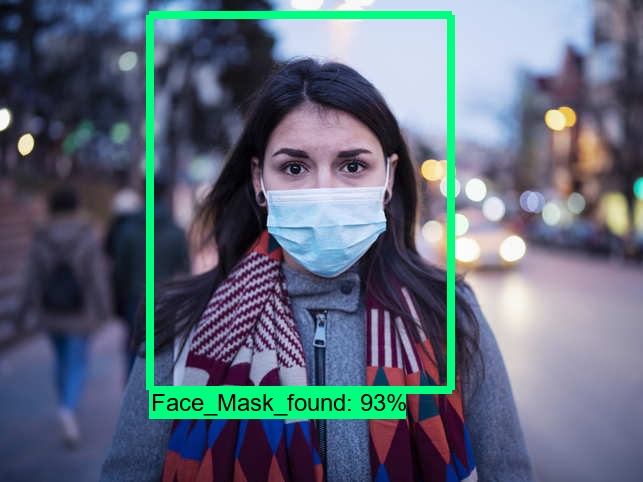

# Face Mask Detection

Face Mask Detection System built with OpenCV, Keras/TensorFlow using Deep Learning and Computer Vision concepts in order to detect face masks in real-time video streams.

The dataset can be downloaded from [Github](https://github.com/chandrikadeb7/Face-Mask-Detection/tree/master/dataset).

